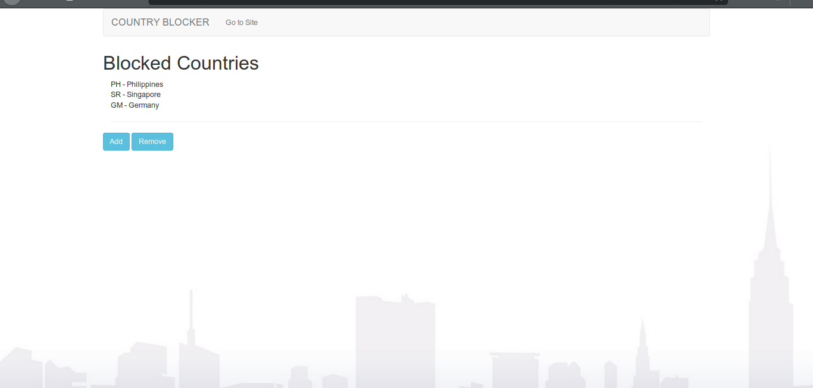

# CountryBlocker using php
A tool/add-on to website that blocks user's from a certain country from viewing the site. 

HOW TO USE:

1. edit php/blocker.php:

function checkifblocked($country){

        if (file_exists('src/blocked_country.txt') ) {
          $deny_country = explode("\n", file_get_contents('src/blocked_country.txt'));
        }
        
        if ( (array_search($country, $deny_country))!== FALSE ) {
        
          header("Location: error.html"); 

        }

        else{

          header(""); # EDIT HERE: path to your webpage</b>
        }

    }
 
 
 Insert the path to your homepage in the header tag.
 
 2. In your Homepage file, include this line in to your code:
            
            <?php  
      
            include("php/blocker.php");
      
            ?>
 
 3. Configure Blocked countries by Navigating to config.php
               

